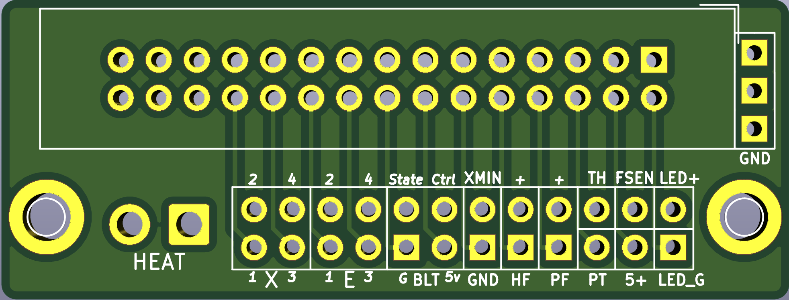
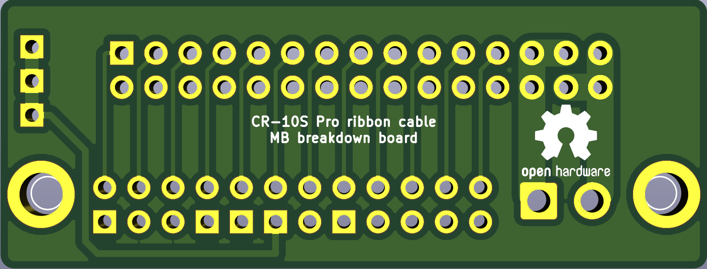
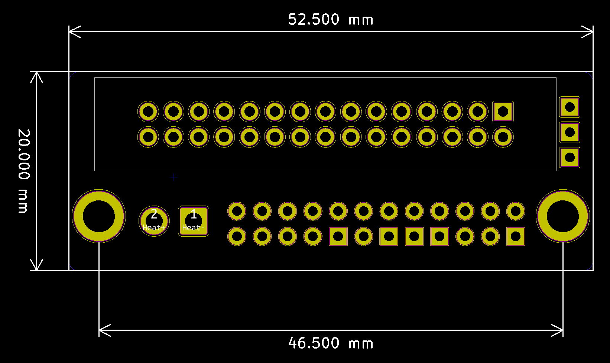

# Ribbon cable breakdown board "pig tail"
Ts is  "pig tail" soldering oriented, semi compatible with original transfer board, but fully compatible with [Transfer board](../Transfer_Board/). Has dedicated 4-wire connection for BLTouch and 3-wire connector for LED.

